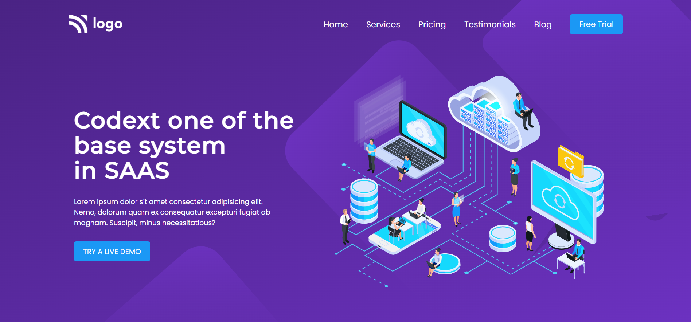
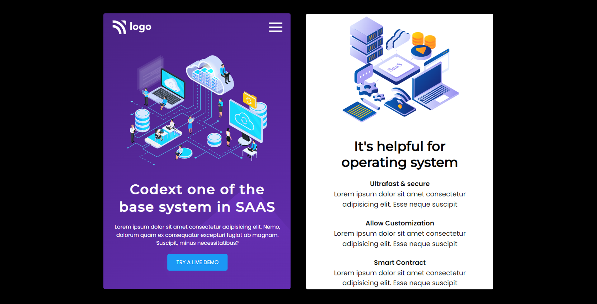

# Saas Landing Page

## [Live Site](https://saas-landing-webpage.netlify.app/)

## Introduction

This is a code repository for the fully responsive Saas Landing Page.

## Time taken to finish this project

It took me about 4 hours to complete this project.

## What I learned from this Project?

- Learnd to use css media queries.
- Learnd to use css flex-box.
- Learnd to use css background-image and border-radius properties.
